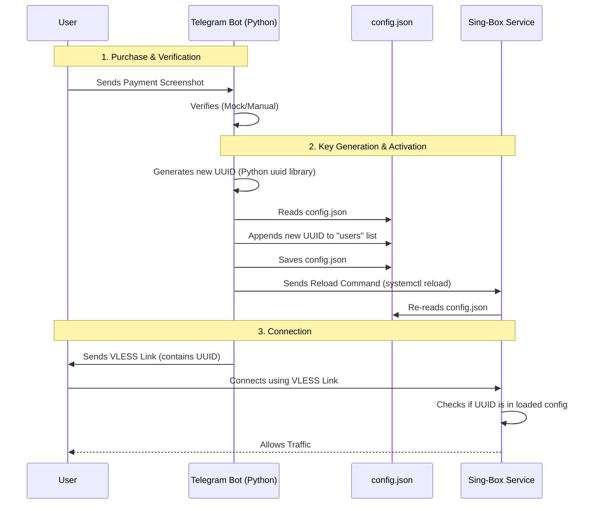

# VPN Bot Architecture

Here is how the Telegram Bot and Sing-Box Server work together to generate keys and allow access.

## The "Key" Concept
In VLESS (the protocol we are using), a "Key" is just a **UUID** (Universally Unique Identifier).
- It's not a file.
- It's just a string like `550e8400-e29b-41d4-a716-446655440000`.
- The server has a list of "allowed UUIDs" in its `config.json`.

## The Process Flow



## Code Walkthrough

### 1. Generating the UUID
In `bot/main.py`, we use Python's built-in library:
```python
import uuid
user_uuid = str(uuid.uuid4()) # Generates a random UUID
```

### 2. Updating the Config
In `bot/config_manager.py`, we load the JSON file and add the user:
```python
def add_user_to_config(uuid, email):
    config = load_config()
    # Add to the first inbound (VLESS)
    config['inbounds'][0]['users'].append({
        "uuid": uuid,
        "name": email
    })
    save_config(config)
```

### 3. Applying Changes
We tell Sing-Box to reload without dropping connections:
```python
subprocess.run(["sudo", "systemctl", "reload", "sing-box"])
```
Now Sing-Box knows about the new UUID and will accept connections from it.
